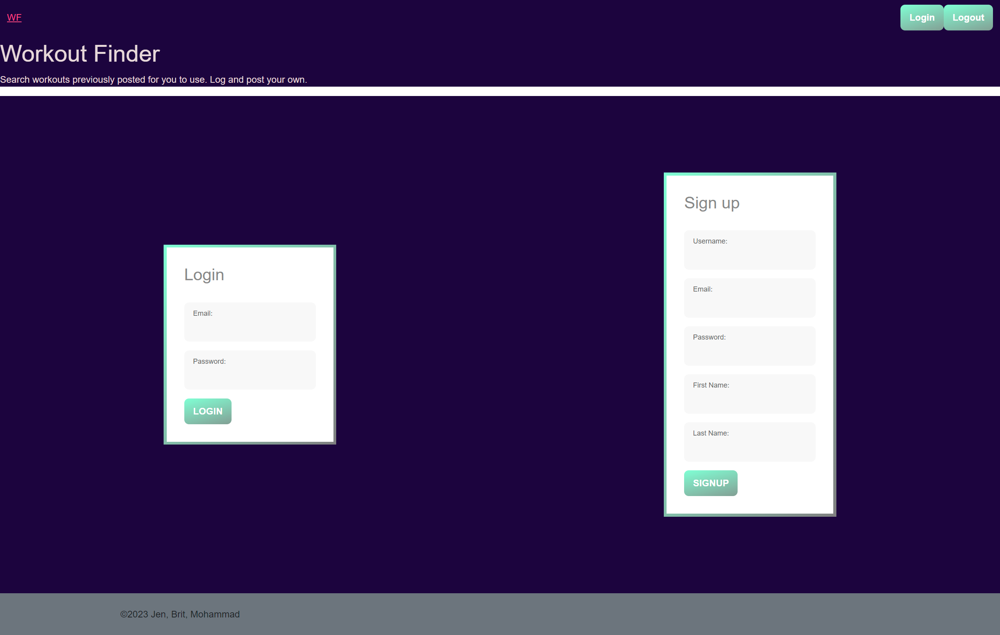
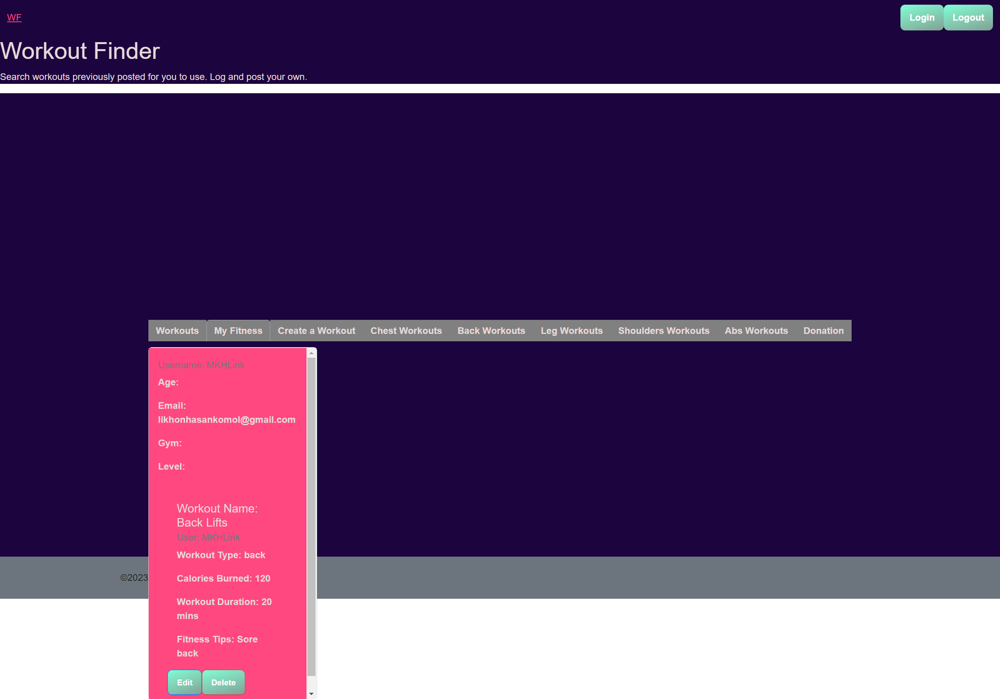

# Title
Workout Finder

# Table of Contents
[Description](#description)

[Installation](#instalation)

[Usage](#usage)

[Heroku](#heroku)

[Contributors](#contributors)

[Questions](#questions)

## Description
Give new users and existing gym goers a sense of community when they workout. Log into to you account where you can search for different types of workouts based on workout type (abs, legs, back, chest, shoulders).  Then create and log workouts to see what you’ve done in the past.

## Installation
Follow the heroku link to see the deployed application, or clone the repo and use 'npm i' followed by 'npm run develop' to get the server and react app to start

## Usage
As a User 
I would like to filter and find a workout based on focus area (abs, legs, back, chest, shoulders) OR search all workouts
So that I can know what exercises to complete to target that areas
As a User 
I would like to have a login and profile 
So that I can log and keep track of all of my previous workouts

## Heroku
https://workout-finder.herokuapp.com/

## Screentshots

## Contributors
Brit Sovic, Jen Hano, Mohammad Komol Hasan

## Questions
Brit Sovic
 
GitHub: bsovic23
 
Email: bsovic@tulane.edu

Jen Hano
 
GitHub: Jmhano
 
Email: jmhano@gmail.com
 

Mohammad Komol Hasan
 
GitHub: MKHLink
 
Email: likhonhasankomol@gmail.com
    